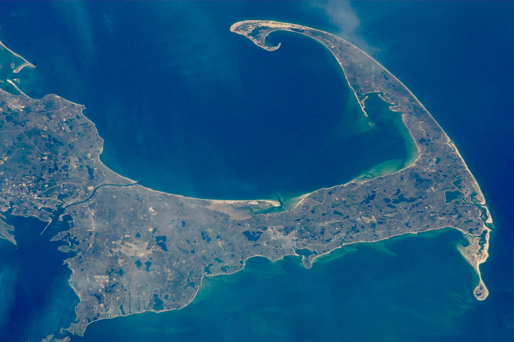

# Burgess Community Page

Picture of the finished project

Live site can be viewed here - link

# Contents

* [Introduction](#introduction)
* [Project](#project)
    * [Site Objectives](#site-objectives)
* [User Experience / UX](#user-experienceux)
    * [Target Audience](#target-audience)
    * [User Stories](#user-stories)
        * [New Visitor Goals](#new-visitor-goals)
        * [Existing Visitor Goals](#existing-visitor-goals)
* [Design Choice](#design-choice)
    * [Typography](#typography)
    * [Color Scheme](#color-scheme)
    * [Logo & Favicon](#logo--favicon)
    * [Wireframes](#wireframes)
    * [Flow Diagram](#flow-diagram)
    * [Database Plan](#database-plan)
* [Features](#features)
    * [Sign Up / Registration](#sign-up--registration)
    * [Creating a Discussion](#creating-a-discussion)
    * [Commenting on a Discussion](#commenting-on-a-discussion)
    * [Profile Customisation](#profile-customisation)
    * [Future Features](#future-features)
* [Technologies Used](#technologies-used)
* [Programming Languages, Frameworks & Libraries Used](#programming-languages-libraries--frameworks-used)
* [Agile](#agile)
* [Testing](#testing)
* [Deployment](#deployment)
    * [Github Deployment](#github-deployment)
    * [Creating a Fork or Copying](#creating-a-fork-or-copying)
    * [Clone](#clone)
    * [Repository Deployment via Heroku](#repository-deployment-via-heroku)
    * [Deployment of the App](#deployment-of-the-app)
* [Credits](#credits)
* [Media](#media)
* [Acknowledgements & Thanks](#acknowledgements--thanks)

# Introduction

Welcome to the Burgess Community Page, a website designed to be used by the staff of Camp Burgess in Sandwich, Massachussetts. 

Camp Burgess is an overnight summer camp based in Cape Cod, Massachusetts. The camp was founded in 1928 by the South Shore YMCA and since the 60s has had an influx of international staff working there, with staff being hired from all over the world.

The Burgess Community Page is a website which is designed to give staff members, old and new, a platform to communicate within a grander scale. Staff members are able to create discussions within the community website where they can discussion fond memories and ongoing experiences that all relate to working at Camp Burgess.

# Project

## Site Objectives

The objectives of the Burgess Community Page are as follows..

- ### Create clean, readable front-end code that is accessible and easily navigated by users.

I aim to create a website with not only flare and accessibility, but a website that has a unique User Interface through the use of both Bootstrap and Django. 

- ### Make use of available back-end functionality

Through the use of backend frameworks, the user will be able to create their own profile within the Burgess Community where they can customise to their liking. Furthermore, upon authentication, the user will be able to create and edit their own discussion posts, as well as leave comments on other discuussion too. 

- ### Store data on an external cloud database

I will be using ElephantSQL to store the PostgreSQL database for this project.

# User Experience/UX

## Target Audience

- The target audience for the Burgess Community Page will be staff members, current and old, who are interested in sharing their experiences and memories with other like-minded individuals.

- Ideally the website will attract the attention of future staff members that share similar goals and interests to the current staff. In turn, this will encourage the Burgess Staff community to grow and raise awareness of the opportunity to work abroad for interested individuals. 

## User Stories

### New Visitor Goals

- Gauge an understanding of what Camp Burgess is along with creating an understanding of summer camp culture.
- Successfully navigate around the site and read discussions from existing members.
- Create their own account and profile as well as engage with other site users.

### Existing Visitor Goals

- Log in and out of their account.
- Interact with new and exisitng users.
- Customise and update their profile page to give a sense of individuality within the website.
- Create and edit comments on other users' discussions.

# Design Choice

## Typography

## Color Scheme

## Logo & Favicon

## Wireframes

## Flow Diagram

## Database Plan

# Features

## Sign Up / Registration

## Creating a Discussion

## Commenting on a Discussion

## Profile Customisation

## Future Features

# Technologies Used

# Programming Languages, Libraries & Frameworks Used

# Agile

# Testing

The testing file for the Burgess Community Page can be viewed [here](/TESTING.md)

# Deployment

## GitHub Deployment

## Creating a Fork or Copying

## Clone

## Repository Deployment via Heroku

## Deployment of the App

# Credits

# Media

# Acknowledgements & Thanks