# Burgess Community Page

Live site can be viewed here - [Burgess Community Page](https://burgess-community-22799d4a8274.herokuapp.com/)

# Contents

* [Introduction](#introduction)
* [Project](#project)
    * [Site Objectives](#site-objectives)
* [User Experience / UX](#user-experienceux)
    * [Target Audience](#target-audience)
    * [User Stories](#user-stories)
        * [New Visitor Goals](#new-visitor-goals)
        * [Existing Visitor Goals](#existing-visitor-goals)
* [Design Choice](#design-choice)
    * [Typography](#typography)
    * [Color Scheme](#color-scheme)
    * [Logo & Favicon](#logo--favicon)
    * [Wireframes](#wireframes)
    * [Flow Diagram](#flow-diagram)
    * [Database Plan](#database-plan)
* [Features](#features)
    * [Sign Up / Registration](#sign-up--registration)
    * [Creating a Discussion](#creating-a-discussion)
    * [Commenting on a Discussion](#commenting-on-a-discussion)
    * [View Staff Profile](#view-staff-profiles)
    * [Create Profile](#create-profile)
    * [Future Features](#future-features)
* [Technologies Used](#technologies-used)
* [Programming Languages, Frameworks & Libraries Used](#programming-languages-libraries--frameworks-used)
* [Agile](#agile)
* [Testing](#testing)
* [Deployment](#deployment)
    * [Github Deployment](#github-deployment)
    * [Creating a Fork or Copying](#creating-a-fork-or-copying)
    * [Clone](#clone)
    * [Repository Deployment via Heroku](#repository-deployment-via-heroku)
    * [Deployment of the App](#deployment-of-the-app)
* [Credits](#credits)
* [Media](#media)
* [Acknowledgements & Thanks](#acknowledgements--thanks)

# Introduction

Welcome to the Burgess Community Page, a website designed to be used by the staff of Camp Burgess in Sandwich, Massachussetts. 

Camp Burgess is an overnight summer camp based in Cape Cod, Massachusetts. The camp was founded in 1928 by the South Shore YMCA and since the 60s has had an influx of international staff working there, with staff being hired from all over the world.

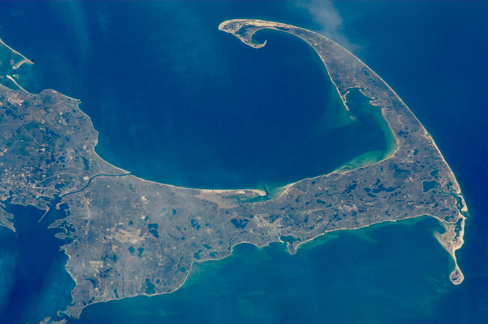

The Burgess Community Page is a website which is designed to give staff members, old and new, a platform to communicate within a grander scale. Staff members are able to create discussions within the community website where they can discussion fond memories and ongoing experiences that all relate to working at Camp Burgess.

# Project

## Site Objectives

The objectives of the Burgess Community Page are as follows..

- ### Create clean, readable front-end code that is accessible and easily navigated by users.

I aim to create a website with not only flare and accessibility, but a website that has a unique User Interface through the use of both Bootstrap and Django. 

- ### Make use of available back-end functionality

Through the use of backend frameworks, the user will be able to create their own profile within the Burgess Community where they can customise to their liking. Furthermore, upon authentication, the user will be able to create and edit their own discussion posts, as well as leave comments on other discuussion too. 

- ### Store data on an external cloud database

I will be using ElephantSQL to store the PostgreSQL database for this project.

# User Experience/UX

## Target Audience

- The target audience for the Burgess Community Page will be staff members, current and old, who are interested in sharing their experiences and memories with other like-minded individuals.

- Ideally the website will attract the attention of future staff members that share similar goals and interests to the current staff. In turn, this will encourage the Burgess Staff community to grow and raise awareness of the opportunity to work abroad for interested individuals. 

## User Stories

### New Visitor Goals

- Gauge an understanding of what Camp Burgess is along with creating an understanding of summer camp culture.
- Successfully navigate around the site and read discussions from existing members.
- Create their own account and profile as well as engage with other site users.

### Existing Visitor Goals

- Log in and out of their account.
- Interact with new and exisitng users.
- Customise and update their profile page to give a sense of individuality within the website.
- Create and edit comments on other users' discussions.

# Design Choice

In this section the different design choices will be explained along with their thought-process.

## Typography

The main font style that I have used is 'Teko' from [Google Fonts](https://fonts.google.com/specimen/Teko). Teko has been used for the heading tags throughout the project. The typography of Teko fits the purpose of the project as the font-style is definitive and noisy, and in my opinion it reinforces the sleek flare insinuated by the website.

## Color Scheme

The color scheme that I have used is one that I feel best represents the camp culture, and one that I feel creates excellent synergy throughout the entire website. 

- It is no suprise that I have used both `#ffffff` and `#000000` as I feel that these two base colors create a nutricious foundation for any potential color scheme to build upon. I am a big fan of using both black and white as they are so minimalist and I feel that there is a much greater attention to detail with these two colors.

- I used `#d3d3d3` as an emphasis color to add to `#000000` and really make certain features stand out and bring attention to something. For example, any text boxes or hovered links really perform well when using `#d3d3d3` as they provide excellent UX for the user as this sends a message that these areas require your attention.

- I have used `#112a12` as the primary and most consistent color throughout the project. It is featured within both the header and footer of the project, along with any important submit buttons. The thought behind this is that it is a sleek, rich color that will add flare to the website, but more importantly it is a classic camp color which provokes a rural, natursitic feel within the user. 

- Finally, I have used `#CD5909` as a base secondary color. This color is elicited within a majority of the images throughout the website and it provides a completementary viewpoint to `#112a12`.

## Logo & Favicon

- The logo used was provided by Camp Burgess and Hayward.

- The Favicon used was a cartoon campfire found over at [Vector Stock](https://www.vectorstock.com/royalty-free-vector/campfire-vector-917478). 

## Wireframes

Below are a list of the wireframes I have created for inspiration to follow for the project.

### Mobile Wireframes

- Here is the mobile wireframe for the home page.

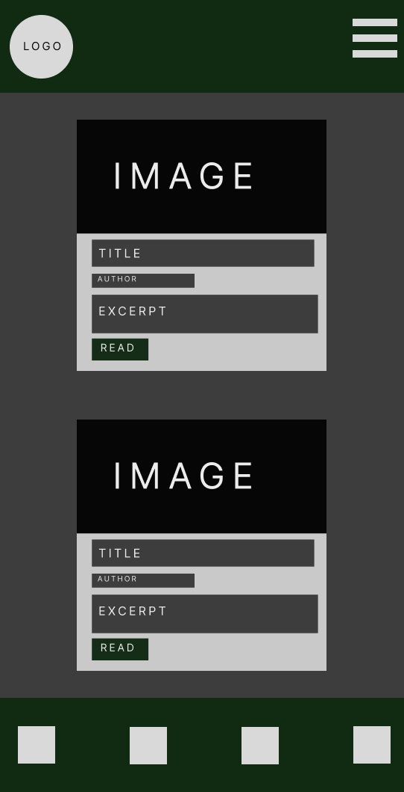

- Here is the mobile wireframe for the discussion content page when being viewed on a mobile device.

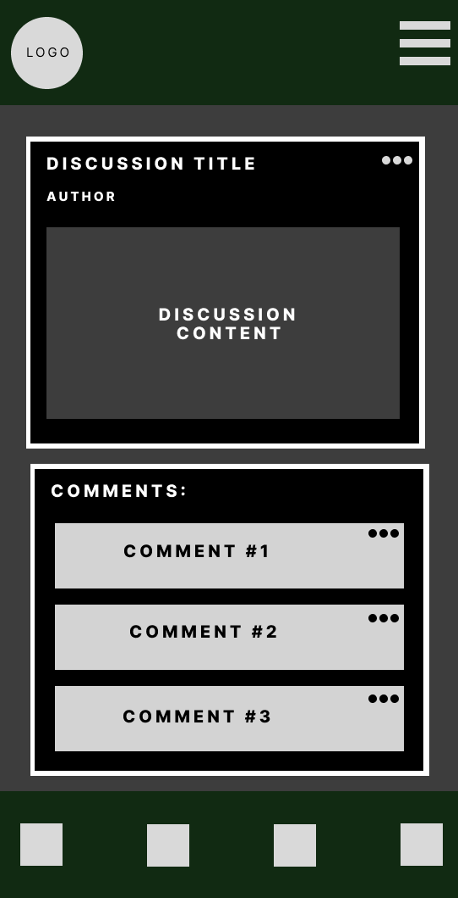

- Here is the mobile wireframe for the staff profile page when being viewed on a mobile device.

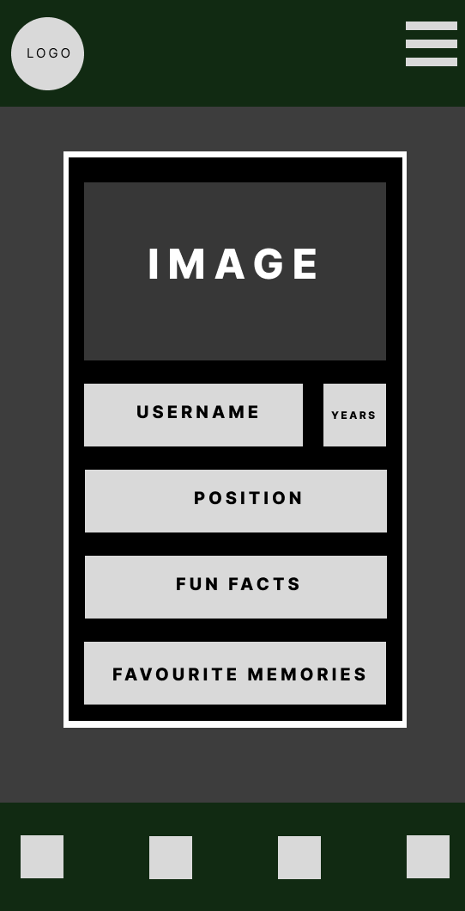

### Desktop Wireframes

- Here is the desktop wireframe for the home page.

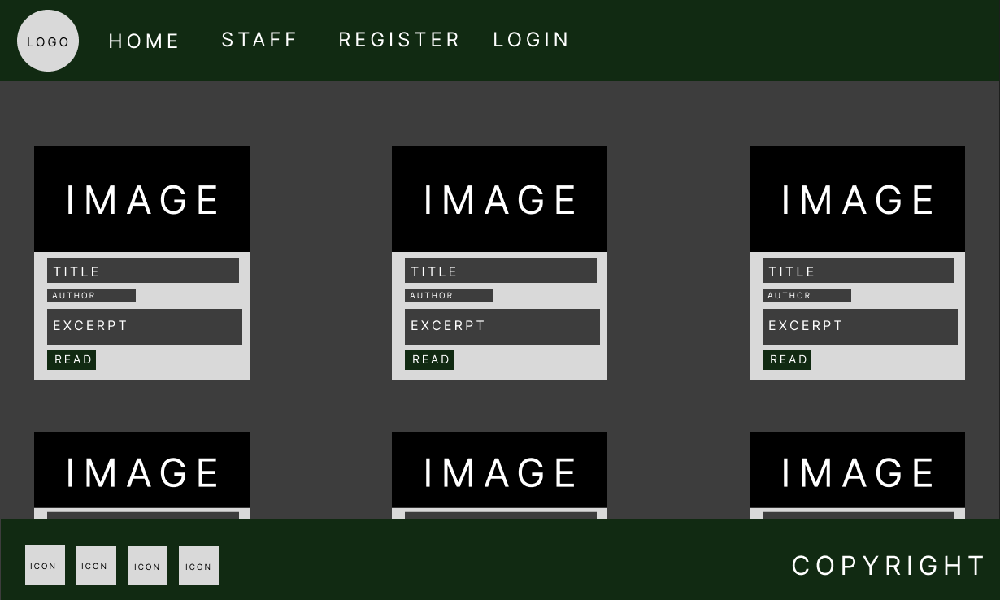

- Here is the wireframe for the discussion content page when being viewed on a desktop.

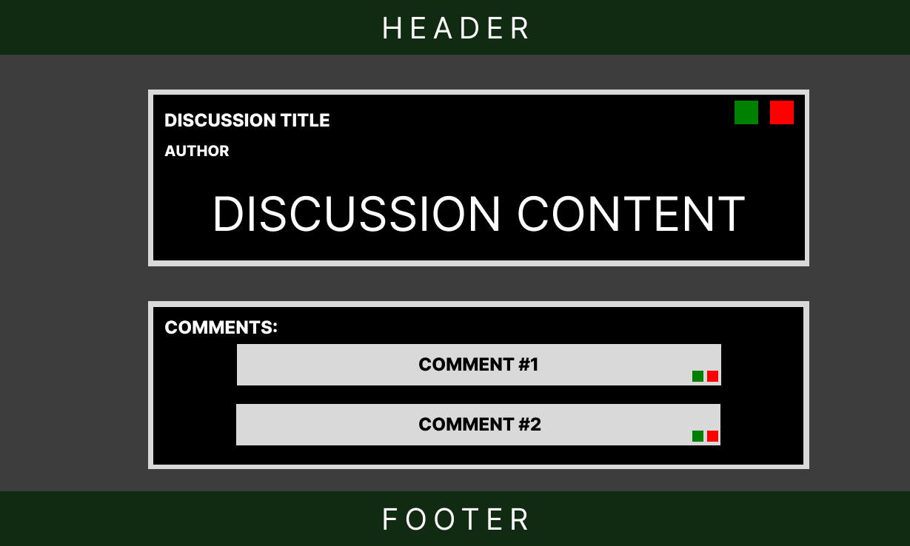

- Here is the wireframe for the staff profile page when being viewed on a desktop.

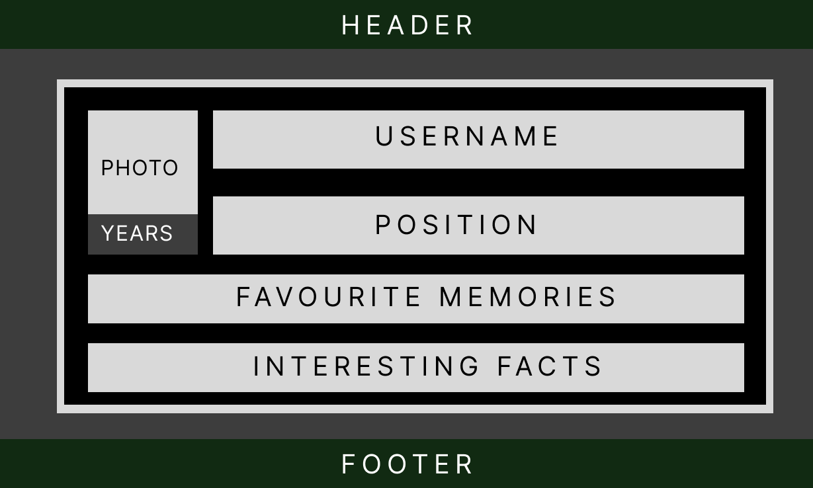

## Flow Diagram

## Database Plan

The database plan is fairly simple, here it shows the information that is stored wihtin the database, the type of data which is being stored, and finally, whether or not a primary or foreign key is being used.

### Discussion ERD

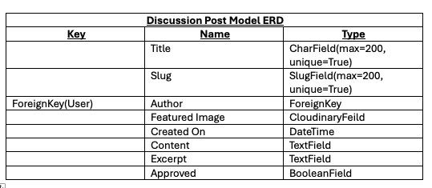

### Comment ERD

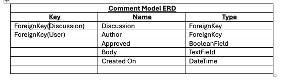

### Staff ERD

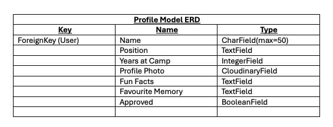

# Features

Below are the list of current features throughout the website. There is a section towards the end discussing future features which will be implemented at a future date.

## Sign Up / Registration

Here is a screenshot of the registration page. Here the user is able to create a profile for the website. There are validation and authentication techniques in place designed to provide better security as well as a better user experience. The user is required to sign up via an email address, and before they can log in they must first verify their email through email verification methods.

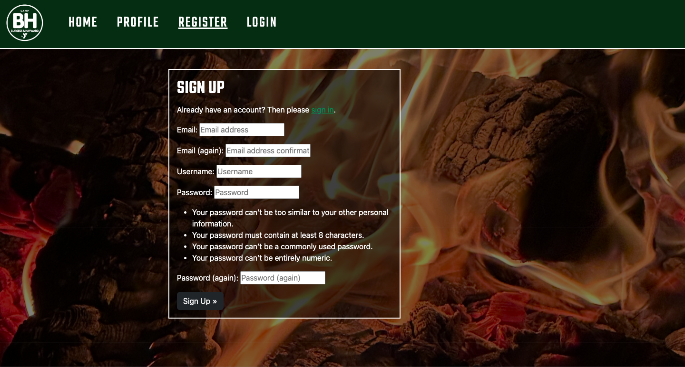

## Creating a Discussion

Here is a screenshot of the form where users are able to create a discussion. Before this form is available to the user, they must first sign in to their account, this is so only verified and genuine users can add to the website's discussions. The main fields that the user can fill out are..
- Title
- Excerpt
- Content

If any of these fields are not filled out, then the user will not be able to submit the discussion. This is so that there are no empty fields being submitted to the database that may cause any anomalies. Furthermore this just provides more integrity within the website.

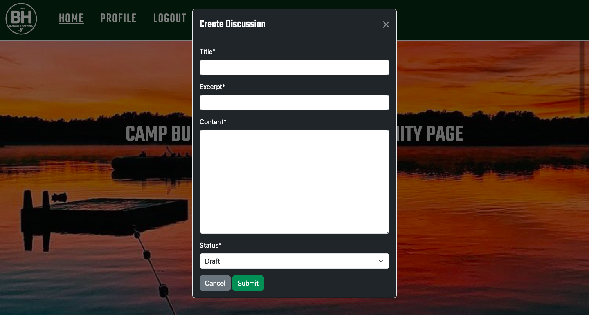

## Commenting on a Discussion

Below is a screenshot of the form where users are able to post comments on other discussions. This form is only present to users who have logged in, this is so that only verified users can post comments and it minimises the risk of spam and other unneccessary comments. 

Upon the comment being submitted, the comment will be in a state of awaiting approval off one of the site admins. This is to protect the site users in the event of a comment that may need censoring. In the event of a previously existing comment being editing, upon submittion the comment will then fall back into a state of awaiting approval.

In the event of the discussion being deleted, all related comments to said discussion will also be deleted.

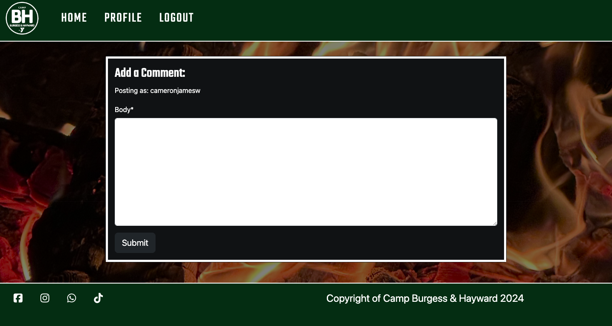

## View Staff Profiles

Below is a screenshot of the staff profile page, all users of the website will be able to access this page and view the current staff members of Camp Burgess & Hayward. With the two camps being seperate, there is a filter where the user is able to view just the Burgess staff members, or just the Hayward staff members. There is a drop down menu under the staff link where the user is able to access this.

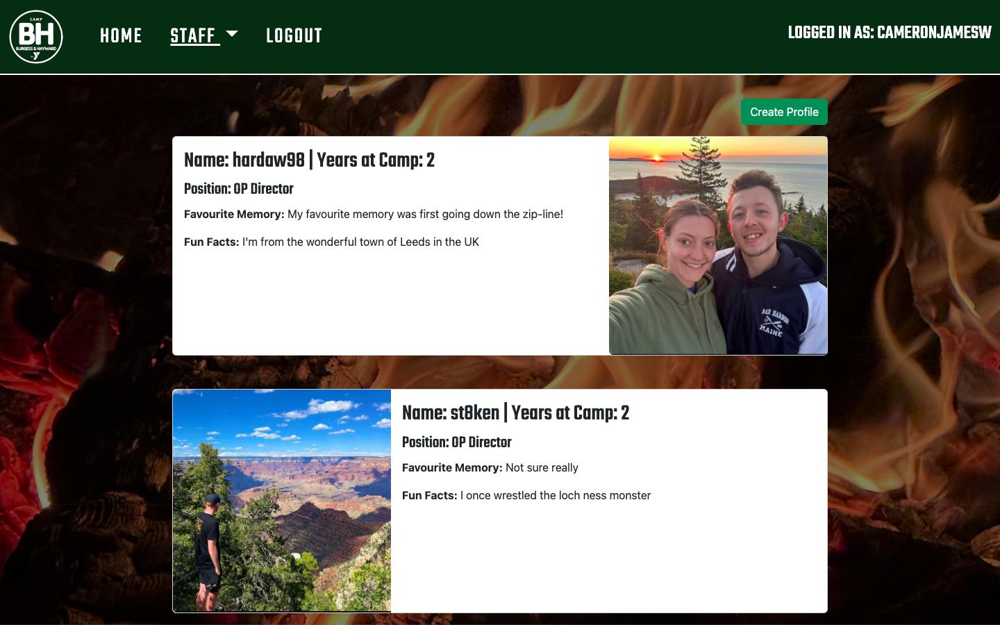

## Create Profile

Within the staff profiles page, the user is able to create their own profile to add to the page, providing they are authenticated. They can fill out a form to their liking and which best matches their summer camp experience. Defensive coding has been used here, the profile will only be displayed on the page once an admin has approvied it. Furthermore, in the instance that a user tries to create a second profile, they will recieve an error stating that they can only have one profile.

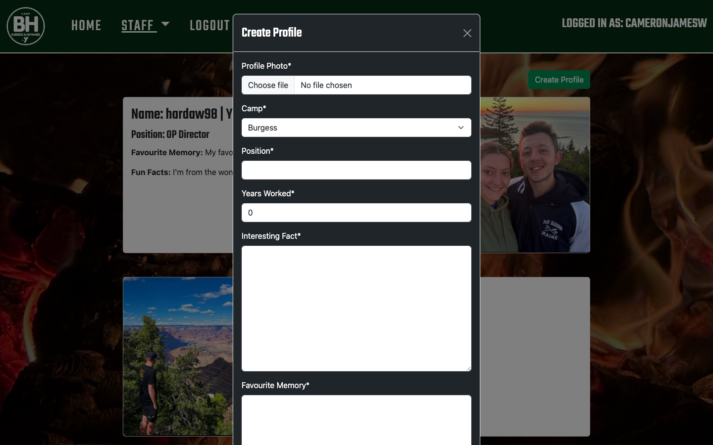

## Future Features

- As per the canban board within the [Agile project board](https://github.com/users/cameronjamesw/projects/5/views/1), there was a user story that I never had the chance to implement into the website. This feature was a way of tracking site growth, mainly for the benefit of the admin. This feature would allow the admin to track the amount of users and see that number grow over a period of time, thus helping future-proof the staff members of Camp Burgess & Hayward.

- Another feature which I will look to implement in the future is full CRUD functionality for the staff page. Currently users only have the ability to Create and Read the content currently on the page; however, there is no option for them to Update or Delete their user profile. Adding these features to the staff page will create further individuality for the user as well as providing for a better user experience. 

# Technologies Used

- [GitPod](https://www.gitpod.io/) was used to build and create the project
- [GitHub](https://github.com/) was used to host and store data for the website
- [Heroku](https://heroku.com/) was used to deploy the project
- [ElephantSQL](https://www.elephantsql.com/) was used to store the postgreSQL database
- [PEP8 Validator](https://pep8ci.herokuapp.com/) was used to validate the python code
- [Cloudinary](https://cloudinary.com/) was used as cloud storage for images uploaded as part of the discussion posts

# Programming Languages, Libraries & Frameworks Used

- [HTML](https://developer.mozilla.org/en-US/docs/Web/HTML)
- [CSS](https://developer.mozilla.org/en-US/docs/Learn/Getting_started_with_the_web/CSS_basics)
- [JavaScript](https://developer.mozilla.org/en-US/docs/Learn/Getting_started_with_the_web/JavaScript_basics)
- [Python](https://en.wikipedia.org/wiki/Python_(programming_language))
- [Django](https://www.djangoproject.com/)
- [Bootstrap](https://getbootstrap.com/)
- [CrispyForms](https://www.djangoproject.com/)
- [GoogleFonts](https://fonts.google.com/)
- [Font Awesome](https://fontawesome.com/)

# Agile

This project was created through using the Agile Methodology. 

The project's structure and progression from start to finish can be seen [here](https://github.com/users/cameronjamesw/projects/5/views/1)

As mentioned earlier, one of the user stories within the canban board has not yet been completed. Here I am refering to the site growth user story, where the client is able to track the site growth over time to help future proof the business. As per the Agile Methodology, before beginning the project, I decided that this user story should have a priority level of 'could have', and due to timing constraints I have to decide against implementing this feature. I will of course look at implementing this feature at a later date; however, at this time in the project I had to make a decision that the site growth feature was not realistically in the scope of achievability. 

# Testing

The testing file for the Burgess Community Page can be viewed [here](/TESTING.md)

# Deployment

## GitHub Deployment

The website was stored using GitHub for storage of data and version control. To do this I did the following;

After each addition, change or removal of code, in the terminal within your IDE (I used GitPod for this project) type:

- git add .
- git commit -m "meaningful and succinct commit message"
- git push

The files are now available to view within your github repository.

## Creating a Fork or Copying

To clone/fork/copy the repository you click on the fork tab which is situated next to unwatch tab in the top right corner of the page when viewing the repository.

## Clone

To create a clone you do the following;

1. Click on the code tab, left of the Gitpod tab
2. To the right of the repository name, click the clipboard icon
3. In the IED open GitBash
4. Change the working directory to the location you prefer
5. Add Git Clone with the copy of the repository name
6. Clone has been created

## Repository Deployment via Heroku

- On the Heroku Dashboard page, click New and then select Create New App from the drop-down menu.
- When the next page loads insert the App name and Choose a region. Then click 'Create app'
- In the settings tab click on Reveal Config Vars and add the key Port and the value 8000. The credentials for this app were:
    - Cloudinary URL
    - Postgres Database URL
    - Port (8000)
    - Secret Key (unique to you)

- Below this click Add buildpack and choose python and nodejs in that order.

## Deployment of the App

- Click on the Deploy tab and select Github-Connect to Github.
- Enter the repository name and click Search.
- Choose the repository that holds the correct files and click Connect.
- A choice is offered between manual or automatic deployment whereby the app is updated when changes are pushed to GitHub.
- Once the deployment method has been chosen the app will be built and can be launched by clicking the Open app button which should appear below the build information window, alternatively, there is another button located in the top right of the page.

# Credits

- This project was based off of Code Institute's 'I Think Therefore I Blog' project. I would like to thank Code Institute for giving me such a solid and sound knowledge and understanding of using Django along with encorporating back-end PostgreSQL knowledge into the project too. I built heavily upon this inspiration through adding my own styling through mainly Bootstrap, but also minimal CSS where neccessary. I have also encorporated further authentication. along with my own Staff_Member Model, where users can view the current staff members as well as create their own profile.

- I recieved considerable help and advice from the Code Institute Slack Community, and I found them as a pillar to lean on much more than I ever expected to throughout this project. The members within the community helps me decipher issues big and small at all times of the day and I will be eternally grateful for that.

- I would like to thank [Camp Burgess & Hayward](https://www.campburgessandhayward.com/) for giving me the inspiration and the platform to create this project. I have been lucky enough to work for them for 3 summers now, so now I feel I have really come full circle in being able to give back to a community that has given so much to me.

- The wireframe mockups were created using [Figma](https://www.figma.com/)

- The majority of inspiration for this readme was fueled by Mark Daniel and his [example readme](https://github.com/markdaniel1982/MD82-P4/blob/main/README.md). It is a truly great example readme that ensures everyone ticks all the right boxes.

- Thank you to [BugBytes](https://www.youtube.com/@bugbytes3923) and their video on [Handling User Uploads in Django](https://www.youtube.com/watch?v=lKyH_ZGtvwM) for helping debug what turned out to be a very small issue.

# Media

- [Vector Stock](https://www.vectorstock.com/royalty-free-vector/campfire-vector-917478) - The Favicon was taken from Vector Stock

- [Flickr](https://www.vectorstock.com/royalty-free-vector/campfire-vector-917478) - The Cape Cod image was taken from Flickr

- [Camp Burgess & Hayward](https://www.campburgessandhayward.com/) - The logo was given to by the SSYMCA upon working for Camp Burgess

- [PNGITEM](https://www.pngitem.com/middle/hmhxiJi_anonymous-profile-grey-person-sticker-glitch-empty-profile/) - The stock photo icon was taken from PNGITEM

- All the photos used for the discussions were photos that I have taken myself whilst working at Camp Burgess & Hayward

# Acknowledgements & Thanks

- I would like to thank [Net Ninja](https://www.youtube.com/@NetNinja) with his video on [Django Views & URLS](https://www.youtube.com/watch?v=TblSa29DX6I) who's clear and calm explanation reassured me that I do understand Django, and that I was just having a meltdown.

- I would like to thank my mentor Jubril Akolade for looking over me during this project and ensuring I crossed-the-t's and dotted-the-i's in the world of coding.

- I would like to thank my girlfriend, Hannah, for withstanding late nights of coding and comforting me when a URL got the better of me.

- Finally, I would like to thank the community over at Camp Burgess & Hayward for fueling this project idea and giving me the passion and desire to produce a project I am so very proud of!

.JPG)