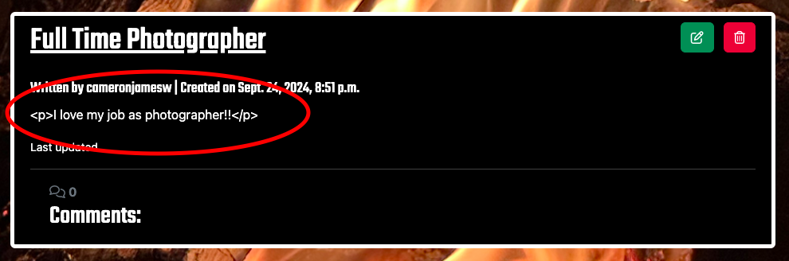

# Burgess Community Page - Testing

Live site can be viewed here - [Burgess Community Page](https://burgess-community-22799d4a8274.herokuapp.com/)

# Contents

* [Introduction](#introduction)
* [Manual Testing](#manual-testing)
* [User](#user)
* [Bugs](#bugs)
* [Lighthouse](#lighthouse)
* [Validation Testing](#validation-testing)
    * [HTML](#html)
    * [CSS](#css)
* [Python Testing](#python-testing)

# Introduction

Throughout the process of creating the Burgess Community Page, I have been conducting tests within each section and function/model. I have mainly been testing for functionality and styling issues, whilst keeping an open eye for any other issues that may pop up. Along with myself performing manual tests, I have also had an array of users, family and friends, testing the website for optimal functionality.

# Manual Testing

In any instance of a fail there is a detailed description and resolution underneath!

### Admin Testing

| Test | Outcome | Pass or Fail
| --- | --- | --- |
| Create Discussion | A successful discussion was created, and was displayed as unapproved to the author, upon approval it was displayed for other users. When displayed though, the discussion content is displayd in HTML code(*). | Fail |
| Edit Discussion | A pre-existing discussion was edited within the admin panel and successfully updated on the discussion page. However, as noted above, the content appears to be in HTML(*). | Fail |
| Approve User Discussion | Discussion appears  for all users within feed upon approval, is not there otherwise | Pass |
| Approve User Comments | Comments appear for all users under relevent discussion when approved | Pass
| Delete User Comments | Comments successfully deleted | Pass |
| Delete Discussions | Successfully deleted discussions | Pass |
| Create Staff Profile | Staff Profile successfully created | Pass |
| Delete Staff Profile | Staff Profile successfully deleted | Pass |
| Delete User | User successfully deleted, along with profile, discussions and exisitng comments | Pass |

(*) - When creating discussions within the admin panel, the content when parsed through to the template appears to be in HTML code, instead of humanly readable content. (see below)

# User

| Test | Outcome | Pass or Fail |
| --- | --- | --- |
| Create Account | Account successfully created with success message, however no verification email is sent to the user(*) | Pass |
| Sign In | User successfully logs in with a log in success message displayed, along with authentication-only options now being present | Pass |
| Sign Out | User successfully logs out along with a log out success message | Pass |
| Create Discussion | Create discussion form successfully submitted, discussion displayed with awaiting approval tag. However featured image is not submitted through form, default placeholder image is shown instead(*) | Fail |
| View Discussion | Discussion successfully viewed, along with options to leave comments | Pass |
| Edit Discussion | Discussion successfully edited, user is returned to the home page upon reverse. Update confirmation message displayed to the user. Discussion approved status is set back to false for admin to approve. | Pass |
| Delete Discussion | Discussion successfully deleted. User is returned back to the home page upon reverse, deletion confirmation message displated to the user. | Pass |
| Create Comment | User successfully created a comment, comment has approved status of false and is only visible to user in question. Comment created message displayed to the user | Pass |
| Edit Comment | Comment successfully updated. Approved status set back to false for admin to approve. Comment updated message displayed to the user. | Pass |
| Delete Comment | Comment successfully deleted by user. If user has previously edited the comment and it has not yet been approved (since being edited) the website throws a 500 Error upon deletion(*) | Pass |
| Filter Staff Profiles by Camp | The user successfully access the staff pages when a filter is applied | Pass |
| Create Staff Profile | User successfully created staff profile page. However as already noted, the profile image field is not updated as per the user's request(*) | Pass |

(*) - see bugs below

# Bugs

### No Authentication Email
- The first bug that I have encountered is within the authentication process. The user is required to sign up with an email, and in doing so an email verification link is sent to the email in question. However, no link is being sent to the user. The current work around that I have for this is that the link for verify the email is being sent to the console, and it is acessissible that way. I have also altered the verification settings so that the user does not need to have their email verified in order for them to log in. I have ensure that the user's experience is not impacted due to no verified email address.

### Images Not Submitted Through Forms 
- The second bug which I encountered is that when submitting a form, if there is an image field within the form then the image is not posted upon submission. I believe this is because the rest of the text fields are of a different data type to the image which is why it is not being posted. This does not throw an error, and the form is still submitted, and because there is a default placeholder image in place as a back up, fixing this bug is not at the top of my priorities given my time frame.

### Background Images Stretching on iOS Devices
- I have encountered this same bug throughout my entire coding journey and I am no closer to debugging this. When the live site is viewed on a mobile iOS device (iPhone, iPad) the background images are extremely stretched. This has been tested on multiple browers, Chrome, FireFox and Safari to name a few, and all the images are the same.
- I have tested this on other devices such as Android devices, and the website renders just fine. This does not effect the performance of the website; however, one could argue that this does effect UX due to the images being unrecognisable. 

### Deleting Unapproved Edited Comments Produces a 500 Error
- From testing, it appears as though unapproved comments that have been edited throw 500 Errors upon deletion. Comments that are created and deleted without being edited cause no issues.
- I have tried to debug this and one of the work arounds that I have found is that if a comment is edited, it will first need to be approved prior to the user attempting to delete it.
- In the URL path, the comment ID has a value of null, so clearly the comments.js file is struggling to read the comment ID once the comment has been edited. 

# Lighthouse

# Validation Testing

## HTML

## CSS

# Python Testing
